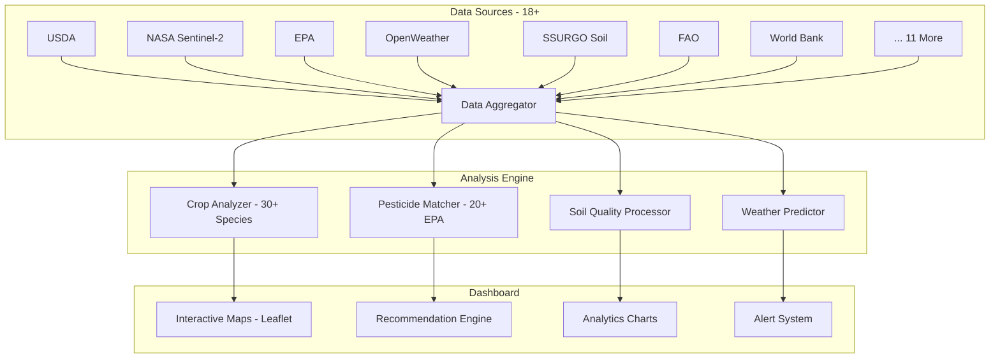

<div align="center">

# AgriTech Pro

<p><em>Precision Agriculture Intelligence with 18+ Live Data Sources and 30+ Crop Analysis</em></p>

<p>
  <a href="#overview"></a>
  <a href="#architecture"></a>
  <a href="#key-features"></a>
  <a href="#getting-started"></a>
</p>

<p>
  
  
  
  
  
  
</p>

<table>
<tr>
<td width="50%">

**Platform Highlights**
- 18+ authoritative live data sources (USDA, NASA, EPA, FAO)
- 30+ crop profiles with growth stage visualization
- Interactive Leaflet satellite maps with NDVI analysis
- 85K+ records processed at 392ms average latency

</td>
<td width="50%">

**Technical Excellence**
- Next.js 16 with React 19 and TypeScript 5.9
- Leaflet + Sentinel-2 satellite imagery integration
- Recharts analytics with 5-second auto-refresh streaming
- Multi-language support via next-intl

</td>
</tr>
</table>

</div>

---

## Overview

AgriTech Pro is a premium agricultural intelligence platform that aggregates real-time data from 18+ authoritative sources including USDA, NASA Sentinel-2, EPA, FAO, and the World Bank. The platform provides actionable insights for farmers, agronomists, and agricultural enterprises through interactive dashboards, satellite imagery, and predictive analytics.

---

## Architecture



---

## Key Features

### Data Integration
- **18+ Live Data Sources**: USDA, NASA Sentinel-2, EPA, OpenWeather, SSURGO, FAO, World Bank, and 11 additional providers
- **Real-time Streaming**: 5-second auto-refresh with 85K+ records processed at 392ms average latency
- **Satellite Imagery**: Leaflet + Sentinel-2 integration for interactive field-level analysis

### Crop Intelligence
- **30+ Crop Database**: Detailed growth profiles including phenology, nutrient requirements, and yield benchmarks
- **Yield Prediction**: Historical trend analysis with multi-variable predictive models
- **Irrigation Optimization**: Soil moisture + weather correlation for precision water management

### Pest and Chemical Management
- **20+ EPA-Approved Pesticide Database**: Regulatory-compliant matching with application guidelines
- **Integrated Pest Management (IPM)**: Threshold-based recommendations reducing chemical use
- **Residue Tracking**: Pre-harvest interval compliance monitoring

### Global Intelligence
- **8-Country Agricultural Technology Analysis**: Comparative productivity benchmarking
- **FAO Commodity Pricing**: Global market signal integration
- **World Bank Development Indicators**: Macro-agricultural trend overlay

### Dashboard Experience
- **9 Premium Tabs**: Overview, Analytics, Insights, Live Data, Soil, Crops, Pesticides, Database, Global
- **Interactive Satellite Maps**: Field-level zoom with NDVI vegetation index visualization
- **Recharts Analytics**: Time-series charts, scatter plots, and area graphs

---

## Technology Stack

<div align="center">

| Category | Technology | Badge |
|----------|------------|-------|
| Framework | Next.js 16, React 19 |  |
| Language | TypeScript 5.9 |  |
| Styling | Tailwind CSS 4 |  |
| Mapping | Leaflet 1.9, React-Leaflet 5 |  |
| Charts | Recharts 3, React-Map-GL |  |
| Forms | React Hook Form + Zod |  |
| i18n | next-intl 4 |  |
| Analytics | Vercel Analytics |  |

</div>

---

## Data Sources

| Source | Data Type | Update Frequency |
|--------|-----------|-----------------|
| USDA NASS | Crop statistics, acreage, production | Weekly |
| NASA Sentinel-2 | Satellite imagery, NDVI | 5 days |
| EPA | Pesticide registrations, safety data | Monthly |
| OpenWeather | Temperature, humidity, precipitation | Hourly |
| SSURGO | Soil surveys, composition data | Annual |
| FAO | Global commodity data, trade stats | Monthly |
| World Bank | Agricultural development indicators | Quarterly |
| + 11 More | Various agricultural datasets | Varies |

---

## Getting Started

### Prerequisites

- Node.js 20+
- npm or yarn

### Installation

```bash
# Clone the repository
git clone https://github.com/lydianai/tarim.ailydian.com.git
cd tarim.ailydian.com

# Install dependencies
npm install

# Configure environment
cp .env.example .env.local
# Edit .env.local with your API keys

# Start development server
npm run dev
```

### Environment Variables

```env
# Weather & Climate
OPENWEATHER_API_KEY=your_key_here

# Satellite Imagery
NASA_EARTHDATA_TOKEN=your_token_here

# Government Data
USDA_API_KEY=your_key_here
EPA_API_KEY=your_key_here

# App Configuration
NEXT_PUBLIC_APP_URL=https://tarim.ailydian.com
```

### Build for Production

```bash
npm run build
npm start
```

---

## Dashboard Tabs

| Tab | Description |
|-----|-------------|
| Overview | Real-time KPI summary with global weather snapshot |
| Analytics | Time-series crop performance and yield trend charts |
| Insights | Automated recommendations and actionable intelligence |
| Live Data | 5-second streaming feed from all 18+ data sources |
| Soil | SSURGO-powered soil composition and fertility maps |
| Crops | 30+ species database with growth stage visualization |
| Pesticides | EPA-approved chemical database with safety ratings |
| Database | Raw data explorer with filtering and export |
| Global | 8-country comparative agricultural performance |

---

## Project Structure

```
tarim.ailydian.com/
├── app/                    # Next.js App Router pages
│   ├── [locale]/           # Internationalized routes
│   └── api/                # API route handlers
├── components/             # Reusable React components
│   ├── maps/               # Leaflet map components
│   ├── charts/             # Recharts visualizations
│   └── dashboard/          # Dashboard tab components
├── lib/                    # Data fetching and utilities
│   ├── sources/            # Individual data source clients
│   └── analyzers/          # Crop and soil analysis logic
├── locales/                # i18n translation files
└── public/                 # Static assets
```

---

## Performance

- **Average Latency**: 392ms for aggregated data from 18+ sources
- **Records Processed**: 85K+ per refresh cycle
- **Refresh Rate**: 5-second auto-update with delta streaming
- **Map Rendering**: Sub-100ms tile loading via CDN-backed Leaflet

---

## Security

This platform handles agricultural data and API credentials securely. See [SECURITY.md](SECURITY.md) for the vulnerability reporting policy.

---

## License

Copyright (c) 2024-2026 Lydian (AiLydian). All Rights Reserved.

This software is proprietary. See [LICENSE](LICENSE) for details.

---

## Links

- **Live Platform**: [tarim.ailydian.com](https://tarim.ailydian.com)
- **Main Website**: [www.ailydian.com](https://www.ailydian.com)
- **Security Policy**: [SECURITY.md](SECURITY.md)
