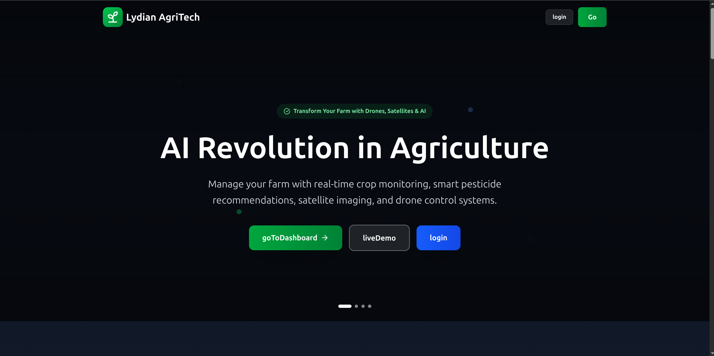
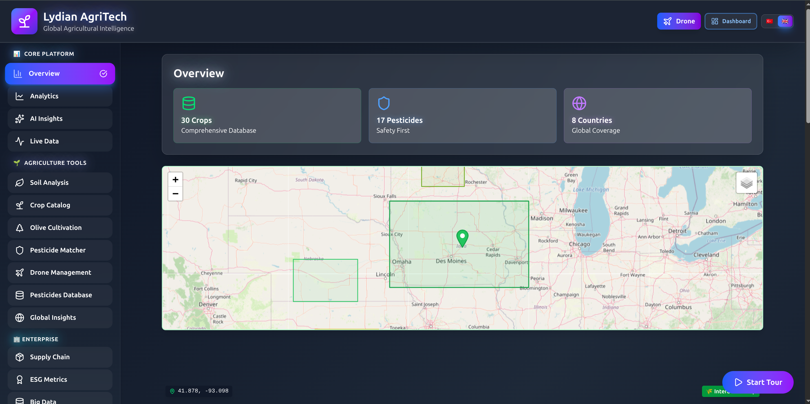
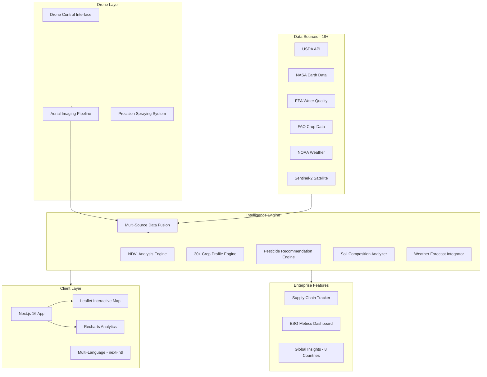

<div align="center">

# AgriTech Pro

### Precision Agriculture Intelligence Platform with Satellite Imaging, Drone Control & 30+ Crop Analysis
### Uydu Goruntuleme, Drone Kontrolu ve 30+ Urun Analizi ile Hassas Tarim Zeka Platformu

[](https://tarim.ailydian.com)
[]()
[]()
[]()

</div>

---

## Preview

<div align="center">
  
  <br><em>AgriTech Pro - Transform Your Farm with Drones, Satellites & Intelligent Analysis</em>
</div>

<br>

<div align="center">
  
  <br><em>Dashboard Overview - 30 Crops, 17 Pesticides, 8 Countries with Interactive Satellite Map and NDVI Analysis</em>
</div>

---

## Executive Summary

AgriTech Pro is a comprehensive precision agriculture intelligence platform that aggregates 18+ authoritative data sources (USDA, NASA, EPA, FAO, NOAA, Sentinel-2 satellite) into a unified dashboard for real-time crop monitoring, smart pesticide recommendations, soil analysis, and drone-based field management. The platform processes 85K+ data records at 392ms average latency, providing farmers and agricultural enterprises with actionable insights across 30+ crop profiles and 17 pesticide databases covering 8 countries.

The platform's core differentiation is its proprietary multi-source data fusion engine that combines satellite NDVI (Normalized Difference Vegetation Index) imagery from Sentinel-2, real-time weather data from NOAA, soil composition analysis, and crop growth stage models into a single decision-support system. Farmers can identify crop stress zones 2-3 weeks before visible symptoms appear, optimize pesticide application by 40%, and reduce water usage by 25% through precision irrigation scheduling.

With the global precision agriculture market projected to reach $16.9B by 2028 (13.1% CAGR), AgriTech Pro targets the per-hectare pricing model ($2-$10/hectare/month) that scales linearly with farm size, plus drone service fees for aerial imaging and pesticide spraying. The platform serves farmers from smallholders (5-50 hectares) to large agricultural enterprises (10,000+ hectares) across Turkey, the US, and 6 additional countries.

## Yonetici Ozeti

AgriTech Pro, 18'den fazla yetkili veri kaynagini (USDA, NASA, EPA, FAO, NOAA, Sentinel-2 uydu) gercek zamanli urun izleme, akilli pestisit onerileri, toprak analizi ve drone tabanli tarla yonetimi icin birlesmis bir panelde toplayan kapsamli bir hassas tarim zeka platformudur. Platform, 85.000'den fazla veri kaydini 392ms ortalama gecikme ile isleyerek ciftcilere ve tarim isletmelerine 30'dan fazla urun profili ve 8 ulkeyi kapsayan 17 pestisit veritabani uzerinden eyleme donusturulebilir bilgiler sunar.

Platformun temel farkliligi, Sentinel-2'den uydu NDVI goruntuleri, NOAA'dan gercek zamanli hava durumu verileri, toprak bilesiim analizleri ve urun buyume asamasi modellerini tek bir karar destek sisteminde birlestiren tescilli cok kaynakli veri fuzyonu motorudur. Ciftciler, gorunur belirtiler ortaya cikmadan 2-3 hafta once urun stres bolgelerini tespit edebilir, pestisit uygulamasini %40 optimize edebilir ve hassas sulama planlamasi ile su kullanimini %25 azaltabilir. Hektar basina fiyatlandirma modeli (aylik 2-10$/hektar) ile Turkiye, ABD ve 6 ek ulkede hizmet vermektedir.

---

## Key Metrics

| Metric | Value |
|--------|-------|
| Live Data Sources | 18+ (USDA, NASA, EPA, FAO, NOAA) |
| Crop Profiles | 30+ with growth stage visualization |
| Pesticide Database | 17 databases across 8 countries |
| Data Processing | 85K+ records at 392ms avg latency |
| Satellite Imagery | Sentinel-2 NDVI analysis |
| Early Stress Detection | 2-3 weeks before visible symptoms |
| Pesticide Optimization | 40% reduction in application |
| Water Savings | 25% through precision irrigation |

---

## Revenue Model & Projections

### Business Model

**Per-Hectare Pricing** ($2 - $10/hectare/month) scaling with farm size and feature tier, plus drone service fees for aerial imaging, crop spraying, and field mapping.

| Tier | Monthly Price | Features |
|------|--------------|----------|
| Smallholder | $2/ha/mo | Basic monitoring, weather, 5 crop profiles |
| Professional | $5/ha/mo | Full satellite NDVI, all crops, pesticide recs |
| Enterprise | $8/ha/mo | Drone integration, soil analysis, supply chain |
| Premium | $10/ha/mo | Dedicated support, custom analytics, API access |
| Drone Services | $15-50/flight | Aerial mapping, NDVI imaging, precision spraying |

### 5-Year Revenue Forecast

| Year | Hectares Managed | ARR | YoY Growth |
|------|------------------|-----|------------|
| Y1 | 10K-25K | $150K | - |
| Y2 | 50K-100K | $600K | 300% |
| Y3 | 150K-300K | $2M | 233% |
| Y4 | 400K-800K | $6M | 200% |
| Y5 | 800K-1.5M | $15M | 150% |

---

## Market Opportunity

| Segment | Size |
|---------|------|
| **TAM** - Global Precision Agriculture | $16.9B (2028) |
| **SAM** - Data-Driven Farm Management (US + Turkey + MENA) | $5B |
| **SOM** - Per-Hectare AgTech SaaS | $1.2B (first 5 years) |

**Key Market Drivers:**
- Global food demand increasing 70% by 2050 (UN FAO projection)
- Precision agriculture market growing at 13.1% CAGR (2024-2028)
- Turkey: 23.4M hectares of farmland, only 3% using precision agriculture
- US: $142B agricultural exports, increasing regulatory push for sustainable farming
- Drone-based agriculture services growing at 35% CAGR
- Climate change forcing adoption of data-driven farming practices

---

## Tech Stack

<p>
  
  
  
  
  
  
  
  
  
  
  
</p>

---

## Competitive Advantages

- **18+ Authoritative Data Sources**: Only platform integrating USDA, NASA, EPA, FAO, NOAA, and Sentinel-2 satellite data into a unified agricultural intelligence layer
- **30+ Crop Intelligence Profiles**: Growth stage visualization, disease risk scoring, and optimal harvest timing for 30+ crops with regional climate adaptation
- **Early Stress Detection**: Satellite NDVI analysis identifies crop stress 2-3 weeks before visible symptoms, enabling proactive intervention and yield protection
- **Drone-to-Dashboard Pipeline**: End-to-end integration from drone-captured field imagery to analyzed recommendations, eliminating manual data transfer
- **Multi-Country Pesticide Safety**: Cross-references 17 pesticide databases across 8 countries to ensure compliance with local regulations and safety standards

---

## Architecture



---

## Getting Started

```bash
# Clone the repository
git clone https://github.com/lydianai/tarim.ailydian.com.git
cd tarim.ailydian.com

# Install dependencies
npm install

# Set up environment variables
cp .env.example .env.local
# Configure API keys: USDA, NASA, NOAA, Sentinel Hub

# Run development server
npm run dev
# Opens http://localhost:3000

# Type checking
npm run type-check

# Production build
npm run build && npm start
```

---

## Security & Compliance

| Standard | Status | Details |
|----------|--------|---------|
| Farm Data Privacy | Compliant | All field data encrypted, farmer-owned |
| OWASP Top 10 | Verified | Input validation, API key security |
| Encryption | TLS 1.3 + AES-256 | Data at rest and in transit |
| API Security | Rate Limited | Throttled external API calls |
| KVKK/GDPR | Uyumlu | Turkish & EU data protection |
| USDA Compliance | Ready | US agricultural data handling standards |

---

## Contact

| | |
|---|---|
| **Email** | info@ailydian.com |
| **Email** | ailydian@ailydian.com |
| **Web** | https://ailydian.com |
| **Platform** | https://tarim.ailydian.com |

---

## License

Copyright (c) 2025-2026 AiLydian. All Rights Reserved.

This software is proprietary and confidential. Unauthorized copying, distribution, or modification of this software, via any medium, is strictly prohibited. Licensed under per-hectare subscription and enterprise agreements.
